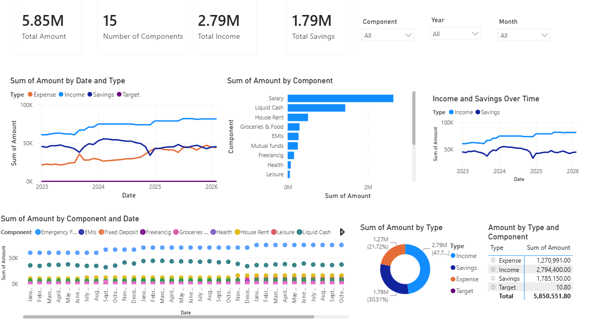

# Financial Analytics Dashboard

A Power BI dashboard developed to analyse financial transactions, income, savings,
expenses, and financial trends over time.

## Features
- 4-table dimensional data model
- Power Query data transformation
- Interactive filters and slicers
- Analysis across 15 financial components
- Income, savings, and expense trend analysis

## Tools
- Power BI
- Power Query
- Data Modelling

## Dashboard Preview

## Files
- `Financial_Analytics_Dashboard.pbix` – Power BI project
- `Financial_Analytics_Report.pdf` – Project documentation
